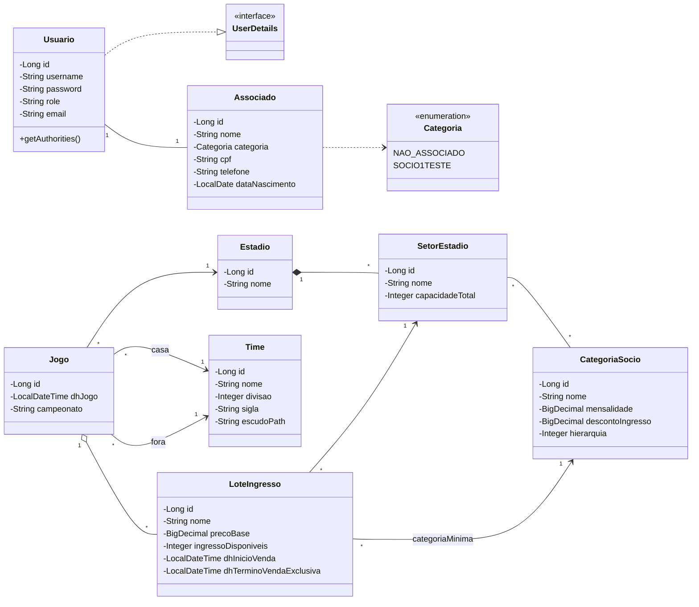
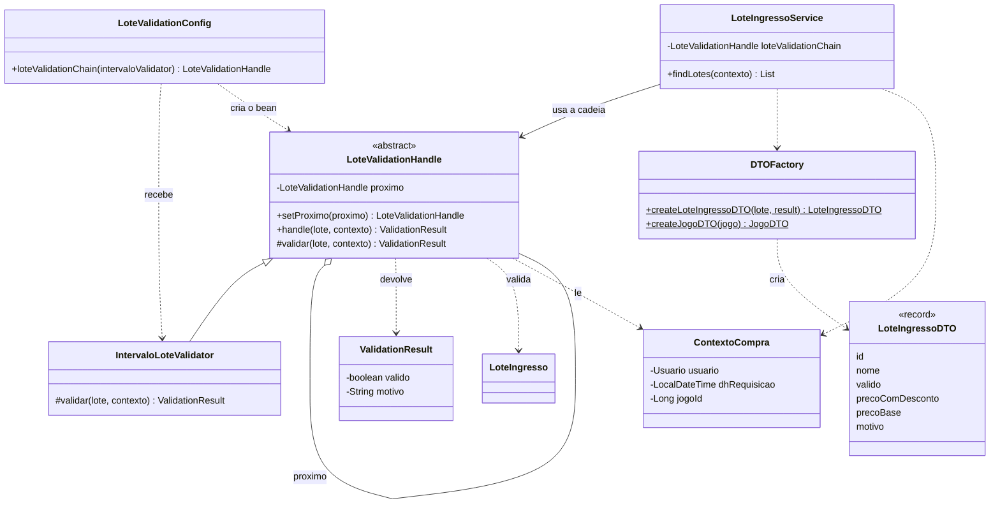
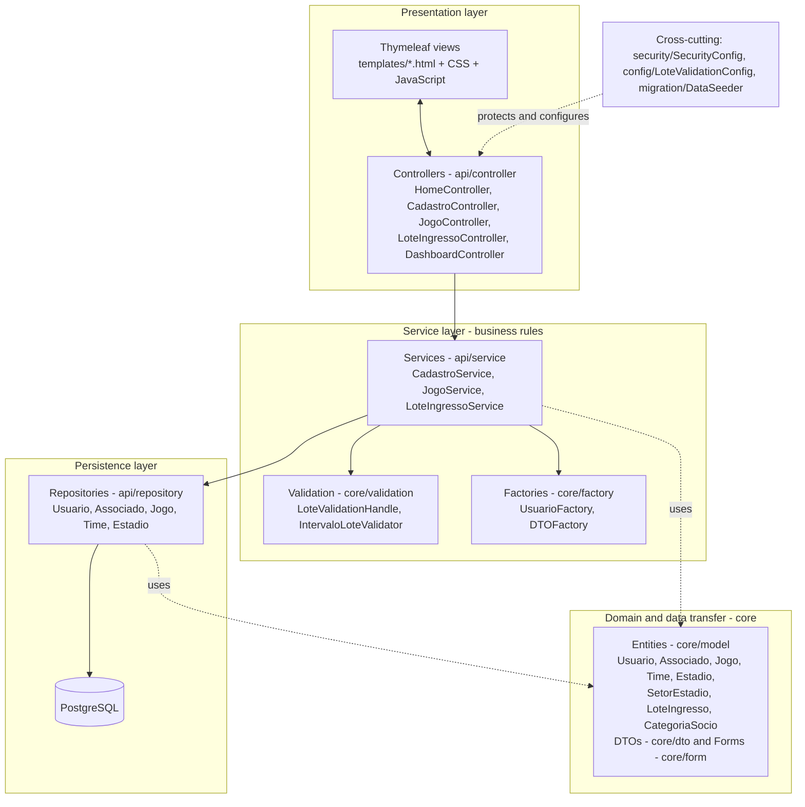
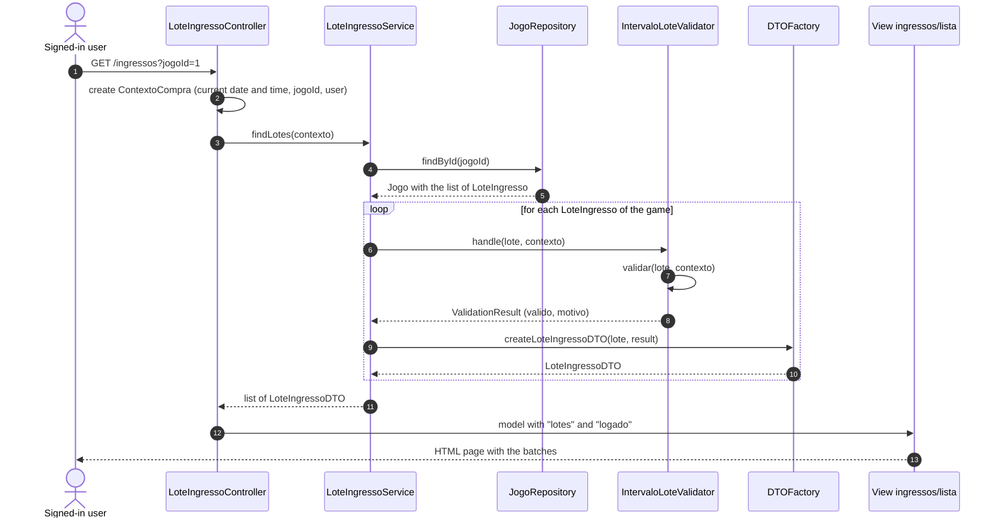
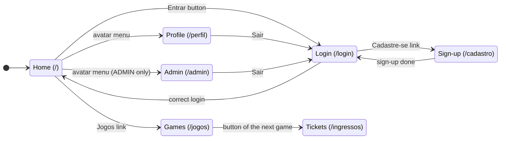
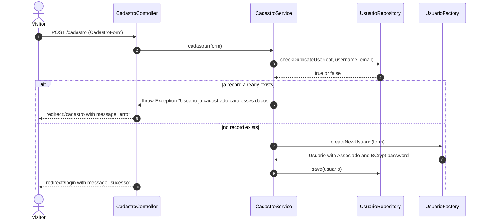

# Documentation of the Sócio-Torcedor Management System

Project of the Object-Oriented Programming Language (LPOO) course — Computer Science, IFSul.

**Team:** Allan Theodoro, Bernardo Zavistanovicz Deters, Olavo Appel Neto and Thomas Cansian dos Santos.

**Versions of this document:** [Português](../pt-br/documentacao.md) · English (this file) · [Leitura Fácil](../leitura-facil/leitura-facil.md)

> **Writing rules.** This text follows the main rules of ASD-STE100: short sentences, active voice, simple present tense, and one topic in each sentence. The names of classes, files and tools are technical names. They stay in their original form. The text was not checked with the official STE dictionary.

---

## 1. Introduction

This document describes the Sócio-Torcedor Management System. It shows what the system does. It shows how the code is organized. It gives the reason for each design decision.

The document describes the code **as it is today**. Section 3.3 and Section 11 show what does not work yet.

The UML diagrams are in Section 8. The source files of the diagrams are in the folder `docs/diagramas/`.

## 2. System purpose

The system helps a football club to manage its supporters (sócio-torcedores). The project proposal has four areas:

1. **Member management:** sign-up of new members and change of plan.
2. **Categories and discounts:** member classes, with prices and discounts for each class.
3. **Ticket control:** prices for each championship and control of ticket sales for the games.
4. **Benefit program:** control of gifts and special experiences.

In this delivery, the system does four things. It signs up users. It logs users in. It shows a calendar of games. It shows the ticket batches of each game. The other areas are not ready (Section 3.3).

The project also shows four skills for the course: documentation, design patterns, graphical user interface, and architecture patterns.

## 3. System description

### 3.1 Technologies

| Item | Technology |
|---|---|
| Language | Java 26 |
| Main framework | Spring Boot 4.1.1 |
| Build tool | Maven (with `mvnw`) |
| Web layer | Spring MVC and Thymeleaf |
| Persistence | Spring Data JPA (Hibernate) |
| Security | Spring Security, with BCrypt passwords |
| Validation | Bean Validation |
| Less repeated code | Lombok |
| Database | PostgreSQL |
| Interface | HTML, CSS and JavaScript |

### 3.2 Features that work

- **User sign-up.** The visitor gives a user name, an e-mail address, a password and a CPF. The system makes a `Usuario` with an `Associado` in the category `NAO_ASSOCIADO`.
- **Login and logout.** The system uses a login form. There are two roles: `USER` and `ADMIN`.
- **Game calendar.** The page shows the games of the year. It shows the next game in a large card. It has a filter for each month.
- **Ticket batches.** The page shows the batches of one game. Each batch is valid or not valid. The page shows the reason.
- **Profile and Admin pages.** Each page shows the name of the user. Only the role `ADMIN` can open the Admin page.
- **Initial data.** The class `DataSeeder` makes the user `admin`, six teams, two stadiums, six games and four batches for the next game.

### 3.3 Features that are not ready

| Item | State in the code |
|---|---|
| Ticket purchase | The button **Comprar** exists. The address `/ingressos/comprar` has no controller. The method `IngressoService.comprarIngresso()` is empty. |
| Become a member | `SocioTorcedorController` is in comments. `SocioTorcedorService.tornarseSocio()` exists, but no class calls it. |
| Discount for each category | The price with discount is the same as the base price (in `DTOFactory`). |
| Benefit program | The entity `BeneficioSocio` exists, but no class uses it. |
| Button **Saiba Mais** | The link goes to `#`. |

### 3.4 How to start the system

1. Install JDK 26 and PostgreSQL.
2. Make an empty database.
3. Set the environment variables `DB_NAME`, `DB_USER` and `DB_PASSWORD`.
4. In the folder `sociotorcedor/`, run `./mvnw spring-boot:run`.
5. Open `http://localhost:8080`.

The system connects to the database at `localhost:5432`. At the first start, the `DataSeeder` makes the initial data. The demonstration user is `admin`, with the password `admin`.

### 3.5 Data storage

The system keeps the data in PostgreSQL. The property `spring.jpa.hibernate.ddl-auto=update` tells Hibernate to make and change the tables. The system does not use migration files.

## 4. Architecture

The system uses a **layered architecture**. For the web part, it uses the Spring **MVC** pattern. Section 6 gives the reasons. This section shows the structure.

### 4.1 Layers

| Layer | Packages | Job |
|---|---|---|
| Presentation | `templates/`, `static/`, `api/controller` | Gets the request from the browser. Calls the service. Selects the page. |
| Service | `api/service`, `core/validation`, `core/factory` | Applies the business rules. Checks the data. Makes objects. |
| Persistence | `api/repository` | Reads and writes the data in the database. |
| Domain and data transfer | `core/model`, `core/dto`, `core/form` | Defines the entities and the objects that go between the layers. |
| Cross-cutting | `security`, `config`, `migration` | Sets the security, the validation chain and the initial data. |

### 4.2 How the layers communicate

- The browser talks only to the controllers.
- The controllers talk only to the services. No controller uses the database.
- The services use the repositories, the factories and the validation chain.
- The repositories talk to PostgreSQL.
- All layers use the domain classes.

Figure 3 (Section 8) shows this structure.

### 4.3 Example of a request

The user opens `/ingressos?jogoId=1`. The `LoteIngressoController` makes a `ContextoCompra`. Then it calls the `LoteIngressoService`. The service gets the game from the `JogoRepository`. The service checks each batch with the validation chain. The `DTOFactory` makes a `LoteIngressoDTO` for each batch. The controller sends the list to the page `ingressos/lista`. Figure 4 shows this flow.

## 5. Design patterns used

The team uses five design patterns. A class or a group of classes implements each pattern.

### 5.1 Chain of Responsibility

- **Problem.** The rules for the sale of a batch will grow. If all rules are in one method, the method has a large `if` block. It is difficult to change.
- **Where it is.** `LoteValidationHandle`, `IntervaloLoteValidator`, `LoteValidationConfig` and `LoteIngressoService`.
- **How it works.** Each rule is a class. Each class gets the batch and checks it. Then it sends the batch to the next class in the chain. The chain stops at the first rule that fails. `LoteValidationConfig` builds the chain. `LoteIngressoService` calls only the first class.
- **Current state.** The chain has **one rule**: `IntervaloLoteValidator`. This rule checks that the time of the request is inside the sale period of the batch. To add a rule, the team writes a new class and connects it with `setProximo()`. The model already has data for new rules, such as `categoriaMinima` and `ingressoDisponiveis`. These rules do not exist yet.
- **Why it is correct.** `LoteIngressoService` does not change when a new rule is added. This follows the open/closed principle.

### 5.2 Template Method

- **Problem.** All rules in the chain must follow the same flow: check, stop if the check fails, call the next rule. A rule must not repeat this flow.
- **Where it is.** `LoteValidationHandle`.
- **How it works.** The method `handle()` is `final`. It sets the order of the steps. The method `validar()` is abstract. Each subclass implements only `validar()`.
- **Why it is correct.** The flow of the chain is in one place. No subclass can change it.

### 5.3 Factory (simple factory)

- **Problem.** Some objects need many steps to make. If these steps are in many places, the code has repeated parts and errors.
- **Where it is.**
  - `UsuarioFactory.createNewUsuario()` makes a `Usuario` with an `Associado`. It sets the category `NAO_ASSOCIADO` and the role `USER`. It encrypts the password.
  - `DTOFactory` changes entities into DTOs (`createJogoDTO` and `createLoteIngressoDTO`).
- **Why it is correct.** `CadastroService` and `JogoService` do not know the details of the object creation. If the creation changes, only the factory changes.

### 5.4 Builder

- **Problem.** The DTOs `JogoDTO` and `TimeDTO` have many fields. A long constructor is difficult to read.
- **Where it is.** The Lombok annotation `@Builder` in `JogoDTO` and in `TimeDTO`. `DTOFactory` uses the builders.
- **Why it is correct.** Each field has its name in the code. The code is easy to read.

### 5.5 Repository

- **Problem.** The business code must not contain code for database access.
- **Where it is.** The interfaces in `api/repository`: `UsuarioRepository`, `AssociadoRepository`, `JogoRepository`, `TimeRepository` and `EstadioRepository`. All of them extend `JpaRepository`.
- **How it works.** Spring Data makes the implementation. The team writes only special queries, such as `findByDhJogoBetween` and `checkDuplicateUser`.

### 5.6 Other support mechanisms

- **DTO and Form.** The pages get `JogoDTO`, `LoteIngressoDTO` and `CadastroForm`. The pages do not get entities.
- **Dependency injection.** Spring makes the objects and gives them to the classes. The services and the factories are Spring beans.

## 6. Architecture patterns

### 6.1 Layered architecture

The system divides the code into layers. Each layer has one job (Section 4.1). A layer calls only the layer below it.

**Reason for the choice.** A change to a page does not change the business rules. A change to the database does not change the controllers. Each team member can work on one layer.

### 6.2 MVC (Model-View-Controller)

| MVC part | In the project |
|---|---|
| **Model** | Entities in `core/model`, DTOs in `core/dto` and forms in `core/form` |
| **View** | Thymeleaf templates in `src/main/resources/templates` |
| **Controller** | Classes in `api/controller` |

Spring MVC has the role of the *front controller*. The `DispatcherServlet` gets all requests. It sends each request to the correct controller. This component belongs to the framework. It is not code of the team.

## 7. Graphical user interface

The interface is a **web** interface. Spring builds the pages on the server with Thymeleaf. The browser shows the HTML, the CSS and the JavaScript.

### 7.1 Pages

| Page | Address | File | Access | Content |
|---|---|---|---|---|
| Home | `/` | `home.html` | Everyone | Only the navigation bar |
| Login | `/login` | `login.html` | Everyone | Login form |
| Sign-up | `/cadastro` | `cadastro.html` | Everyone | Sign-up form |
| Games | `/jogos` | `jogos.html` | Signed-in user | Next game, month filter and list of games |
| Tickets | `/ingressos?jogoId=` | `ingressos/lista.html` | Signed-in user | Batches of the game |
| Profile | `/perfil` | `perfil.html` | `USER` and `ADMIN` | Welcome message |
| Admin | `/admin` | `admin.html` | `ADMIN` only | Welcome message |

The navigation bar is a fragment that all pages use (`fragments/navbar.html`). Each page includes it with `th:replace`.

### 7.2 Basic components

| Component | Where it is |
|---|---|
| Button (`button`) | Avatar in the bar, **Sair**, **Entrar**, **Cadastrar**, calendar months, **Comprar** |
| Link button (`a.btn-cta`) | **Entrar** in the bar, button of the next game |
| Text field | User name (login and sign-up), CPF |
| Password field | Login and sign-up |
| E-mail field | Sign-up |
| Hidden field | `loteId` in the purchase form |
| Label (`label`) | All fields of the forms |
| Form (`form`) | Login, sign-up, logout and purchase |
| Link | **Voltar**, **Cadastre-se**, **Entrar**, **Saiba Mais** |
| Drop-down menu | Avatar menu |
| Cards | Next game, games in the list, batches |
| Image | Team crests |
| Message | "Usuário ou senha inválidos." and "Você saiu da sua conta." |

### 7.3 Events

| Event | Where | What happens |
|---|---|---|
| `onclick` on the avatar button | `navbar.html` | The function `toggleProfileMenu(event)` opens and closes the drop-down menu. |
| `click` on the document | `navbar.html` | The drop-down menu closes when the user clicks outside it. |
| `DOMContentLoaded` | `jogos.html` | The page connects the click event to the month buttons. It shows the games of the active month (September, in the code). |
| `click` on the month buttons | `jogos.html` | The clicked button becomes active. The cards fade out in 150 ms. Only the games of the selected month appear again. If there are no games, the page shows "Nenhum jogo encontrado para este mês." |
| `submit` of the login form | `login.html` | The browser sends `POST /login`. Spring Security does the authentication. |
| `submit` of the sign-up form | `cadastro.html` | The browser sends `POST /cadastro`. |
| `submit` of the logout form | `navbar.html` | The browser sends `POST /logout`. |

### 7.4 Layouts

The CSS uses three layout methods:

- **Flexbox** in the bars, the forms, the cards and the lists (`navbar.css`, `auth.css`, `jogos.css`, `ingressos.css`).
- **CSS Grid** in the game cards (`.jogo-card`, `.confronto-verus`) and in the batch cards (`.lote-card`).
- **Media queries** in `navbar.css` (width up to 900 px) and in `ingressos.css` (width up to 640 px).

The CSS files are in `static/css`: `main.css`, `navbar.css`, `auth.css`, `jogos.css` and `ingressos.css`.

### 7.5 Navigation

Figure 5 (Section 8) shows how the user goes from one page to another. A user who is not signed in and opens `/jogos` or `/ingressos` goes to the login page.

## 8. UML diagrams

| Figure | Type | Purpose | Related section |
|---|---|---|---|
| 1 | Class diagram (domain) | Show the entities and their relations | 3 and 4 |
| 2 | Class diagram (validation) | Show the patterns Chain of Responsibility, Template Method and Factory | 5 |
| 3 | Layer diagram | Show the layered architecture | 4 and 6 |
| 4 | Sequence diagram (batches) | Show the flow of `GET /ingressos` | 4.3 |
| 5 | Navigation diagram (states) | Show the flow between the pages | 7 |
| 6 | Sequence diagram (sign-up) | Show the flow of `POST /cadastro` | 3 and 5 |

All diagrams come from the real code. The domain diagram does not show the entities `Endereco`, `Localidade`, `BeneficioSocio` and `Noticia`, because no other class uses them.

### Figure 1 — Domain classes

*Source file and image: [classes-dominio.mmd](../diagramas/classes-dominio.mmd) · [classes-dominio.png](../diagramas/classes-dominio.png)*

The association between `SetorEstadio` and `CategoriaSocio` is many-to-many. In the code, each side has its own list with `@ManyToMany`.

### Figure 2 — Classes of the batch validation

*Source file and image: [classes-validacao.mmd](../diagramas/classes-validacao.mmd) · [classes-validacao.png](../diagramas/classes-validacao.png)*

### Figure 3 — Layers

*Source file and image: [camadas-en.mmd](../diagramas/camadas-en.mmd) · [camadas-en.png](../diagramas/camadas-en.png)*

### Figure 4 — Sequence: list the batches of a game

*Source file and image: [sequencia-lotes-en.mmd](../diagramas/sequencia-lotes-en.mmd) · [sequencia-lotes-en.png](../diagramas/sequencia-lotes-en.png)*

### Figure 5 — Navigation between the pages

*Source file and image: [navegacao-en.mmd](../diagramas/navegacao-en.mmd) · [navegacao-en.png](../diagramas/navegacao-en.png)*

### Figure 6 — Sequence: user sign-up

*Source file and image: [sequencia-cadastro-en.mmd](../diagramas/sequencia-cadastro-en.mmd) · [sequencia-cadastro-en.png](../diagramas/sequencia-cadastro-en.png)*

Figure 6 shows the current behavior: the controller calls the service and does not read the result of the form check (Section 11).

## 9. Design decisions

Each decision has a reason and a result.

| No. | Decision | Reason | Result |
|---|---|---|---|
| D1 | Use a layered architecture with Spring MVC | Keep the page, the rule and the data apart. Follow the structure that Spring Boot gives. | No controller uses the database. Each layer can change without a change in the other layers. |
| D2 | Check the batch with Chain of Responsibility | The sale rules will grow. Each rule must be in one class. | A new rule needs one new class and one link in the chain. Today there is one rule. |
| D3 | Fix the flow of the chain with Template Method in `LoteValidationHandle` | All rules must follow the same flow. | The method `handle()` is `final`. The subclasses implement only `validar()`. |
| D4 | Make `Usuario` and the DTOs in factories | The creation has many steps, such as the password encryption. | The creation code is in one place. |
| D5 | Send DTOs and Forms to the pages, not entities | The page does not need to know the structure of the database. | A change to an entity does not break the page. |
| D6 | Use `@Builder` from Lombok in `JogoDTO` and `TimeDTO` | These DTOs have many fields. | The object creation is easy to read. |
| D7 | Use Spring Data JPA for the database | Do not repeat the data access code. | The repositories are interfaces. The team writes only special queries. |
| D8 | Use Spring Security, BCrypt and two roles (`USER`, `ADMIN`) | Protect the pages and keep the passwords safe. | The class `Usuario` implements `UserDetails`. This makes the code simple, but it connects the entity to Spring Security. |
| D9 | Build the pages on the server with Thymeleaf and use a navigation fragment | Use the same navigation bar on all pages. Keep the JavaScript small. | Each page includes the fragment with `th:replace`. The JavaScript is inside the HTML files. |
| D10 | Use PostgreSQL, `ddl-auto=update`, environment variables and `DataSeeder` | Make development easy. Do not keep passwords in the code. | The database updates itself. The demonstration starts with data. |

**Known deviation (D11).** The class `InjectionProvider` keeps the repositories in static fields. `CadastroService`, `JogoService` and `LoteIngressoService` use these fields. This practice does not follow the dependency injection of Section 5.6. It makes tests difficult and it hides the dependencies. The classes `DataSeeder`, `JogoController` and `LoteIngressoController` already use constructor injection. The next step is to use the same style in the services.

## 10. Tests

### 10.1 Automatic tests

There is one automatic test: `SociotorcedorApplicationTests.contextLoads()`. It checks that the Spring context starts. The test needs PostgreSQL and the environment variables.

### 10.2 Manual tests

The file [`testes/README.md`](../../testes/README.md) has 14 manual cases for sign-up, login and games:

| Result | Number |
|---|---|
| Passed | 4 |
| Failed | 7 |
| Rule to confirm | 2 |
| Observed behavior | 1 |

### 10.3 Causes found in the code

The code shows three causes for the failures:

1. `CadastroController` gets the `BindingResult`, but it does not read it. The validation annotations of `CadastroForm` do not stop the sign-up.
2. The templates `cadastro.html` and `login.html` do not show the messages `erro` and `sucesso` that the controller sends.
3. The query `checkDuplicateUser` compares `associado.nome` with the user name. It does not compare the field `Usuario.username`.

### 10.4 Planned tests

These tests do **not** exist yet. The class `IntervaloLoteValidator` is the first candidate, because it does not need the database.

| Case | Input | Expected result |
|---|---|---|
| Sale did not start | Time of the request before `dhInicioVenda` | `ValidationResult` not valid, with the reason |
| Sale is open | Time between `dhInicioVenda` and the time of the game | `ValidationResult` valid |
| Game already happened | Time of the request after the game | `ValidationResult` not valid, with the reason |

## 11. Conclusion

The system has a code base in layers. It uses five design patterns and the MVC pattern. The web interface covers sign-up, login, the game calendar and the ticket batches.

### Known limits

- Ticket purchase, member sign-up, discounts and benefits do not work yet (Section 3.3).
- The validation chain has only one rule.
- The sign-up form does not stop wrong data (Section 10.3).
- The route `/jogos` needs a login, but the navigation bar shows the link **Jogos** to visitors.
- The pages Home, Profile and Admin have little content.
- The code uses three styles of dependency injection (Section 9, D11).

### Next steps

1. Read the `BindingResult` in the sign-up and show the messages on the pages.
2. Correct the query `checkDuplicateUser`.
3. Make the purchase endpoint and new rules in the chain (minimum category and ticket stock).
4. Write the unit tests of Section 10.4.
5. Replace the use of `InjectionProvider` with constructor injection.

## 12. Glossary

| Term | Meaning |
|---|---|
| Associado | A person who has a member category. |
| Bean | An object that Spring makes and controls. |
| Layer | A group of classes with the same job. |
| Controller | A class that gets the request from the browser. |
| DTO | A simple object that carries data between the layers. |
| Entity | A class that is connected to a database table. |
| Lote (batch) | A group of tickets for one game, with a price and a sale period. |
| Architecture pattern | A model for the structure of the complete system. |
| Design pattern | A model of a solution for a problem with classes and objects. |
| Repository | An interface that reads and writes data in the database. |
| Service | A class that applies the business rules. |
