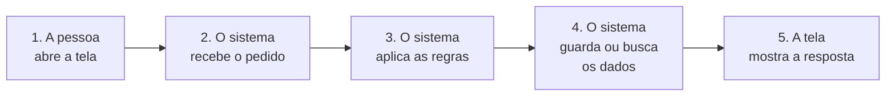

# Sistema de Sócio-Torcedores

## Versão em Leitura Fácil

Este texto explica o nosso projeto de um jeito simples.

Ele é para quem não conhece programação.

Outras versões deste documento:

- [Documentação completa em português](../pt-br/documentacao.md)
- [Documentation in English](../en/documentation.md)

---

## 1. O que é este projeto?

Este projeto é um **sistema de computador**.

Um sistema é um programa que ajuda a fazer uma tarefa.

O nosso sistema ajuda um **clube de futebol**.

O clube tem torcedores que pagam uma mensalidade.

Esses torcedores se chamam **sócio-torcedores**.

O sistema ajuda o clube a cuidar deles.

## 2. Quem fez o projeto?

Quatro estudantes de Ciência da Computação fizeram o projeto.

Eles estudam no **IFSul**.

O projeto é um trabalho da disciplina **LPOO**.

LPOO quer dizer Linguagem de Programação Orientada a Objetos.

Os estudantes são:

- Allan Theodoro
- Bernardo Zavistanovicz Deters
- Olavo Appel Neto
- Thomas Cansian dos Santos

## 3. O que o sistema faz hoje?

O sistema já faz estas coisas:

- **Cadastrar uma pessoa.** A pessoa escreve o nome de usuário, o e-mail, a senha e o CPF.
- **Entrar no sistema.** A pessoa usa o nome de usuário e a senha. Isso se chama **login**.
- **Sair do sistema.** Isso se chama **logout**.
- **Mostrar os jogos do ano.** A pessoa escolhe um mês. O sistema mostra os jogos desse mês.
- **Mostrar o próximo jogo.**
- **Mostrar os lotes de ingressos de um jogo.**

Um **lote** é um grupo de ingressos.

Cada lote tem um preço e um período de venda.

O sistema avisa se o lote está aberto ou fechado para venda.

## 4. O que o sistema ainda não faz?

Algumas coisas ainda não funcionam:

- Comprar o ingresso.
- Virar sócio do clube.
- Dar desconto para cada tipo de sócio.
- Dar brindes aos sócios.

Os estudantes querem fazer essas coisas depois.

## 5. Quem pode usar cada tela?

Uma **tela** é uma página que a pessoa vê no navegador.

| Tela | Quem pode ver |
|---|---|
| Início | Todas as pessoas |
| Entrar | Todas as pessoas |
| Cadastro | Todas as pessoas |
| Jogos | Quem fez login |
| Ingressos | Quem fez login |
| Perfil | Quem fez login |
| Administração | Só o administrador |

O **administrador** é a pessoa que cuida do sistema.

## 6. Como o sistema é feito?

O sistema tem **partes**.

Cada parte tem um trabalho.

Essas partes se chamam **camadas**.

| Camada | Trabalho dela |
|---|---|
| Telas | Mostrar as páginas para a pessoa |
| Serviços | Seguir as regras do clube |
| Dados | Guardar e buscar as informações |

Veja como as camadas trabalham juntas:

*Arquivo-fonte e imagem: [facil-fluxo.mmd](../diagramas/facil-fluxo.mmd) · [facil-fluxo.png](../diagramas/facil-fluxo.png)*

Esta forma de organizar o sistema se chama **arquitetura em camadas**.

Outra forma usada é o **MVC**.

MVC divide o sistema em três partes: **Modelo**, **Visão** e **Controle**.

- O **Modelo** guarda as informações.
- A **Visão** é o que a pessoa vê.
- O **Controle** recebe o pedido da pessoa.

## 7. O que são padrões de projeto?

Um **padrão de projeto** é uma boa solução que muita gente já usou.

É como uma receita de bolo.

A receita ajuda a resolver um problema comum.

Nós usamos cinco padrões:

1. **Cadeia de Responsabilidade.** O sistema confere o lote em passos. Cada passo é uma regra. Hoje temos uma regra: o lote só vende no período certo.
2. **Método Modelo.** Todas as regras seguem o mesmo caminho.
3. **Fábrica.** Uma parte do sistema só faz objetos. Por exemplo, ela monta o cadastro de uma pessoa e esconde a senha.
4. **Construtor.** O sistema monta objetos grandes com calma, um campo de cada vez.
5. **Repositório.** Uma parte do sistema só conversa com o banco de dados.

O **banco de dados** é o lugar onde o sistema guarda as informações.

## 8. Como a pessoa usa o sistema?

Estes são os passos de uma pessoa nova:

1. A pessoa abre a página inicial.
2. A pessoa clica em **Entrar**.
3. A pessoa clica em **Cadastre-se**.
4. A pessoa preenche o cadastro.
5. A pessoa faz o login.
6. A pessoa clica em **Jogos**.
7. A pessoa vê o calendário.
8. A pessoa clica no botão do próximo jogo.
9. A pessoa vê os lotes de ingressos.

## 9. O que tem nas telas?

As telas têm estas partes:

- **Botões.** A pessoa clica neles.
- **Campos.** A pessoa escreve neles.
- **Links.** A pessoa clica e vai para outra tela.
- **Cartões.** Eles mostram um jogo ou um lote.
- **Menu.** Ele abre quando a pessoa clica na foto do perfil.
- **Escudos.** São as imagens dos times.

Quando a pessoa clica, o sistema responde.

Isso se chama **evento**.

Exemplo: a pessoa clica no mês de **outubro**.

O sistema mostra só os jogos de outubro.

## 10. O sistema foi testado?

Sim. Os estudantes fizeram **14 testes** à mão.

Veja o resultado:

| Resultado | Quantidade |
|---|---|
| Deu certo | 4 |
| Deu erro | 7 |
| Falta decidir a regra | 2 |
| Só observamos | 1 |

Os estudantes já sabem onde estão os erros.

Eles vão corrigir os erros.

## 11. O que vem depois?

Os próximos passos são:

1. Mostrar mensagens de erro claras no cadastro.
2. Evitar cadastros com dados errados.
3. Permitir a compra de ingressos.
4. Criar mais regras para os lotes.
5. Fazer mais testes.

## 12. Palavras difíceis

| Palavra | O que quer dizer |
|---|---|
| Sistema | Programa que ajuda a fazer uma tarefa |
| Sócio-torcedor | Torcedor que paga mensalidade ao clube |
| Login | Entrar no sistema com nome e senha |
| Camada | Parte do sistema com um trabalho só |
| Padrão de projeto | Boa solução para um problema comum |
| Banco de dados | Lugar onde o sistema guarda informações |
| Evento | Resposta do sistema a um clique |
| Lote | Grupo de ingressos com preço e período de venda |
