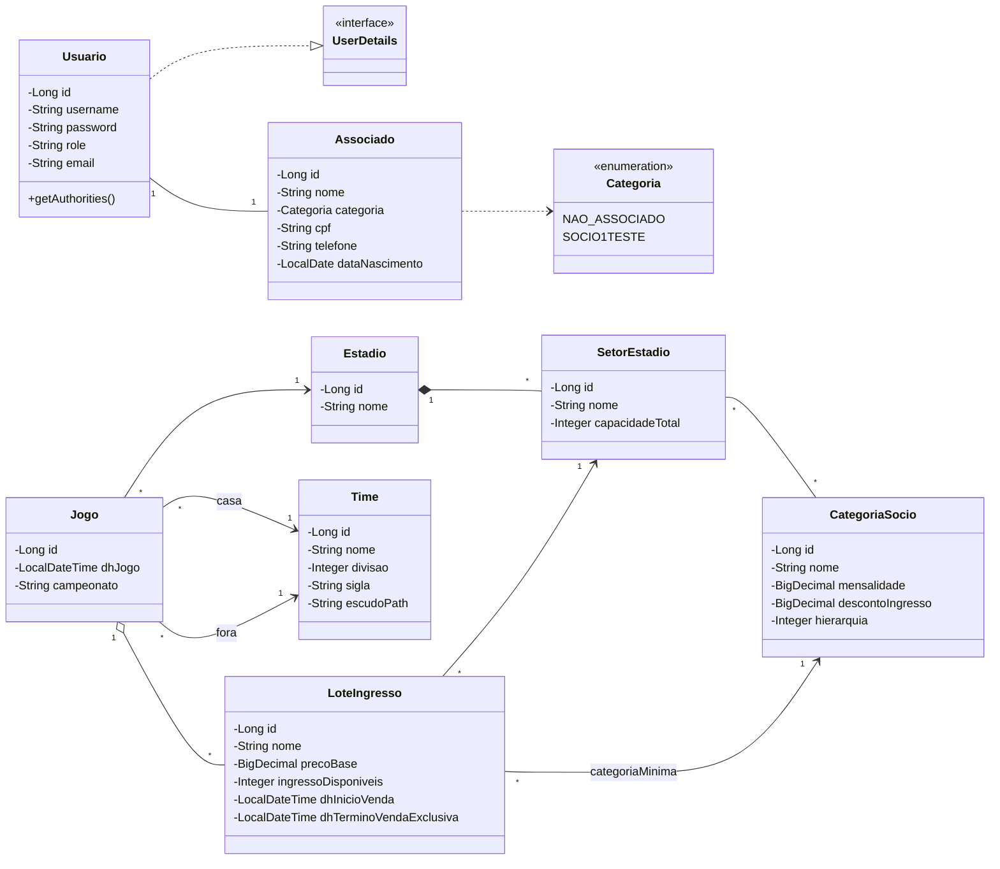
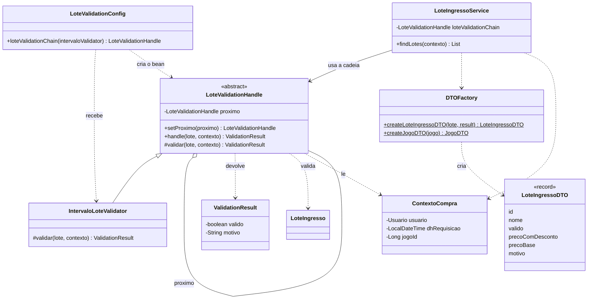
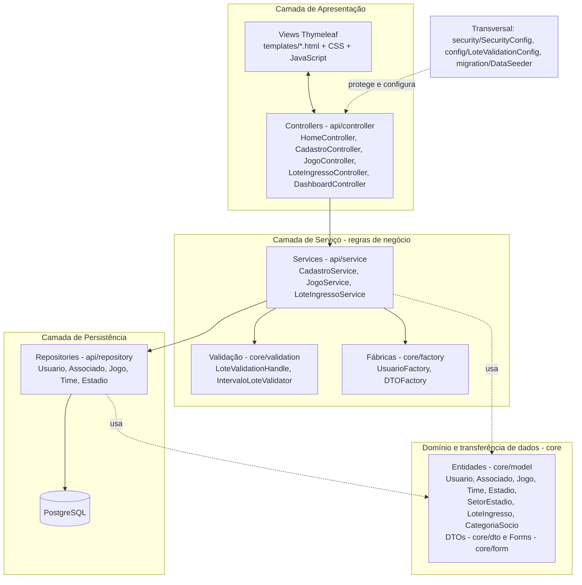
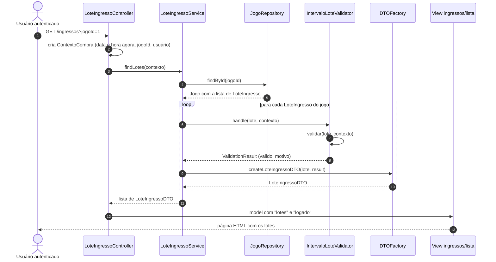
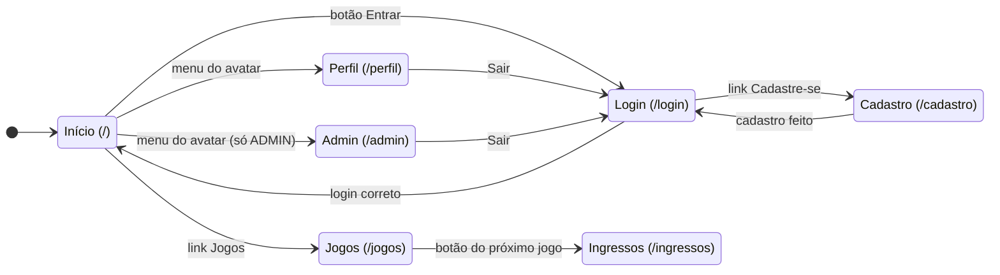
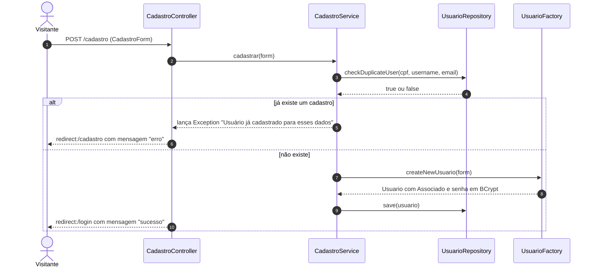

# Documentação do Sistema de Gestão de Sócio-Torcedores

Projeto da disciplina de Linguagem de Programação Orientada a Objetos (LPOO) — Ciência da Computação, IFSul.

**Equipe:** Allan Theodoro, Bernardo Zavistanovicz Deters, Olavo Appel Neto e Thomas Cansian dos Santos.

**Versões deste documento:** Português (este arquivo) · [English](../en/documentation.md) · [Leitura Fácil](../leitura-facil/leitura-facil.md)

---

## 1. Introdução

Este documento descreve o Sistema de Gestão de Sócio-Torcedores. Ele explica o que o sistema faz, como o código está organizado e por que a equipe tomou cada decisão de projeto.

O texto usa frases curtas, voz ativa e um termo fixo para cada conceito. A seção 12 traz o glossário.

O documento descreve o código **como ele está hoje**. O que ainda não funciona aparece de forma clara na seção 3.3 e na seção 11.

Os diagramas UML ficam na seção 8. Os arquivos-fonte dos diagramas ficam na pasta `docs/diagramas/`.

## 2. Objetivo do sistema

O sistema ajuda um clube de futebol a gerir seus sócio-torcedores. A proposta do projeto prevê quatro áreas:

1. **Gestão de associados:** cadastro de novos associados e troca de plano.
2. **Categorias e descontos:** classes de sócios, com preços e descontos para cada classe.
3. **Controle de ingressos:** valores por campeonato e controle da venda dos ingressos dos jogos.
4. **Programa de benefícios:** controle de brindes e de experiências exclusivas.

Nesta entrega, o sistema cobre o cadastro de usuários, o login, o calendário de jogos e a lista de lotes de ingresso de cada jogo. As demais áreas ainda estão em desenvolvimento (seção 3.3).

Nesta disciplina, o projeto também serve para mostrar quatro competências: documentação, padrões de projeto, interface gráfica e padrões de arquitetura.

## 3. Descrição do sistema

### 3.1 Tecnologias

| Item | Tecnologia |
|---|---|
| Linguagem | Java 26 |
| Framework principal | Spring Boot 4.1.1 |
| Gerenciador de build | Maven (com `mvnw`) |
| Camada web | Spring MVC e Thymeleaf |
| Persistência | Spring Data JPA (Hibernate) |
| Segurança | Spring Security, com senhas em BCrypt |
| Validação | Bean Validation |
| Redução de código repetido | Lombok |
| Banco de dados | PostgreSQL |
| Interface | HTML, CSS e JavaScript |

### 3.2 Funcionalidades prontas

- **Cadastro de usuário.** O visitante informa usuário, e-mail, senha e CPF. O sistema cria um `Usuario` com um `Associado` da categoria `NAO_ASSOCIADO`.
- **Login e logout.** O sistema usa formulário de login. Há dois papéis: `USER` e `ADMIN`.
- **Calendário de jogos.** A tela mostra os jogos do ano, o destaque do próximo jogo e um filtro por mês.
- **Lotes de ingresso.** A tela mostra os lotes de um jogo. Cada lote aparece como válido ou inválido, com o motivo.
- **Telas Perfil e Admin.** As duas telas mostram o nome do usuário. A tela Admin só abre para o papel `ADMIN`.
- **Dados iniciais.** A classe `DataSeeder` cria o usuário `admin`, seis times, dois estádios, seis jogos e quatro lotes para o próximo jogo.

### 3.3 Funcionalidades ainda não prontas

| Item | Situação no código |
|---|---|
| Compra de ingresso | O botão **Comprar** existe. O endereço `/ingressos/comprar` não tem controller. O método `IngressoService.comprarIngresso()` está vazio. |
| Tornar-se sócio | `SocioTorcedorController` está comentado. `SocioTorcedorService.tornarseSocio()` existe, mas nenhuma classe o chama. |
| Desconto por categoria | O preço com desconto é igual ao preço base (em `DTOFactory`). |
| Programa de benefícios | A entidade `BeneficioSocio` existe, mas nenhuma classe a usa. |
| Botão **Saiba Mais** | O link aponta para `#`. |

### 3.4 Como executar

1. Instale o JDK 26 e o PostgreSQL.
2. Crie um banco de dados vazio.
3. Defina as variáveis de ambiente `DB_NAME`, `DB_USER` e `DB_PASSWORD`.
4. Na pasta `sociotorcedor/`, execute `./mvnw spring-boot:run`.
5. Abra `http://localhost:8080`.

O banco usa o endereço `localhost:5432`. Na primeira execução, o `DataSeeder` cria os dados iniciais. O usuário inicial de demonstração é `admin`, com a senha `admin`.

### 3.5 Armazenamento de dados

O sistema guarda os dados no PostgreSQL. A propriedade `spring.jpa.hibernate.ddl-auto=update` faz o Hibernate criar e atualizar as tabelas. O sistema não usa arquivos de migração.

## 4. Arquitetura

O sistema usa **arquitetura em camadas** e, na parte web, o padrão **MVC** do Spring. A seção 6 explica as duas escolhas. Esta seção mostra a organização.

### 4.1 Camadas

| Camada | Pacotes | Responsabilidade |
|---|---|---|
| Apresentação | `templates/`, `static/`, `api/controller` | Recebe o pedido do navegador. Chama o serviço. Escolhe a tela. |
| Serviço | `api/service`, `core/validation`, `core/factory` | Aplica as regras de negócio. Valida. Cria objetos. |
| Persistência | `api/repository` | Lê e grava os dados no banco. |
| Domínio e transferência de dados | `core/model`, `core/dto`, `core/form` | Define as entidades e os objetos que viajam entre as camadas. |
| Transversal | `security`, `config`, `migration` | Configura a segurança, a cadeia de validação e os dados iniciais. |

### 4.2 Como as camadas se comunicam

- O navegador fala só com os controllers.
- Os controllers falam só com os serviços. Nenhum controller acessa o banco.
- Os serviços usam os repositórios, as fábricas e a cadeia de validação.
- Os repositórios falam com o PostgreSQL.
- Todas as camadas usam as classes do domínio.

A Figura 3 (seção 8) mostra essa organização.

### 4.3 Exemplo de um pedido

O usuário abre `/ingressos?jogoId=1`. O `LoteIngressoController` cria um `ContextoCompra` e chama o `LoteIngressoService`. O serviço busca o jogo no `JogoRepository`. Depois, o serviço valida cada lote com a cadeia de validação. O `DTOFactory` cria um `LoteIngressoDTO` para cada lote. O controller envia a lista para a tela `ingressos/lista`. A Figura 4 mostra esse fluxo.

## 5. Padrões de projeto utilizados

A equipe usa cinco padrões de projeto. Cada padrão tem uma classe ou um grupo de classes que o implementa.

### 5.1 Chain of Responsibility (Cadeia de Responsabilidade)

- **Problema.** As regras para vender um lote vão crescer. Colocar todas em um único método cria um `if` grande e difícil de mudar.
- **Onde aparece.** `LoteValidationHandle`, `IntervaloLoteValidator`, `LoteValidationConfig` e `LoteIngressoService`.
- **Como funciona.** Cada regra é uma classe. Cada classe recebe o lote, valida e passa o lote para a próxima classe da cadeia. A cadeia para na primeira regra que falha. O `LoteValidationConfig` monta a cadeia. O `LoteIngressoService` só chama a primeira classe.
- **Situação atual.** A cadeia tem **uma regra**: `IntervaloLoteValidator`. Ela verifica se o horário do pedido está dentro do período de venda do lote. Para criar uma nova regra, a equipe escreve uma nova classe e liga a classe com `setProximo()`. O modelo já tem dados para novas regras, como `categoriaMinima` e `ingressoDisponiveis`. Essas regras ainda não existem.
- **Por que serve.** O `LoteIngressoService` não muda quando uma regra nova entra. Isso segue o princípio aberto/fechado.

### 5.2 Template Method (Método Modelo)

- **Problema.** Todas as regras da cadeia precisam seguir o mesmo fluxo: validar, parar se falhou, chamar a próxima regra. Cada regra não pode refazer esse fluxo.
- **Onde aparece.** `LoteValidationHandle`.
- **Como funciona.** O método `handle()` é `final`. Ele define a ordem dos passos. O método `validar()` é abstrato. Cada subclasse implementa só o `validar()`.
- **Por que serve.** O fluxo da cadeia fica em um único lugar. Nenhuma subclasse consegue mudá-lo.

### 5.3 Factory (Fábrica simples)

- **Problema.** Criar alguns objetos exige vários passos. Espalhar esses passos pelo código gera repetição e erro.
- **Onde aparece.**
  - `UsuarioFactory.createNewUsuario()` monta um `Usuario` com um `Associado`, define a categoria `NAO_ASSOCIADO` e o papel `USER`, e criptografa a senha.
  - `DTOFactory` converte entidades em DTOs (`createJogoDTO` e `createLoteIngressoDTO`).
- **Por que serve.** O `CadastroService` e o `JogoService` não conhecem os detalhes da criação. Se a criação mudar, só a fábrica muda.

### 5.4 Builder (Construtor)

- **Problema.** Os DTOs `JogoDTO` e `TimeDTO` têm vários campos. Um construtor longo é difícil de ler.
- **Onde aparece.** A anotação `@Builder` do Lombok em `JogoDTO` e em `TimeDTO`. O `DTOFactory` usa os builders.
- **Por que serve.** Cada campo aparece com o seu nome no código. A leitura fica clara.

### 5.5 Repository (Repositório)

- **Problema.** O código de negócio não deve conter código de acesso ao banco.
- **Onde aparece.** As interfaces de `api/repository`: `UsuarioRepository`, `AssociadoRepository`, `JogoRepository`, `TimeRepository` e `EstadioRepository`. Todas estendem `JpaRepository`.
- **Como funciona.** O Spring Data cria a implementação. A equipe escreve só consultas específicas, como `findByDhJogoBetween` e `checkDuplicateUser`.

### 5.6 Outros mecanismos de apoio

- **DTO e Form.** As telas recebem `JogoDTO`, `LoteIngressoDTO` e `CadastroForm`. As telas não recebem entidades.
- **Injeção de dependência.** O Spring cria os objetos e os entrega às classes. Os serviços e as fábricas são beans do Spring.

## 6. Padrões de arquitetura

### 6.1 Arquitetura em camadas

O sistema separa o código em camadas. Cada camada tem uma responsabilidade (seção 4.1). Uma camada só chama a camada logo abaixo.

**Por que a equipe escolheu.** A mudança em uma tela não altera a regra de negócio. A mudança no banco não altera os controllers. Cada pessoa da equipe pode trabalhar em uma camada.

### 6.2 MVC (Model-View-Controller)

| Parte do MVC | No projeto |
|---|---|
| **Model** | Entidades de `core/model`, DTOs de `core/dto` e forms de `core/form` |
| **View** | Templates Thymeleaf em `src/main/resources/templates` |
| **Controller** | Classes de `api/controller` |

O Spring MVC faz o papel do *front controller*: o `DispatcherServlet` recebe todos os pedidos e os entrega ao controller correto. Esse componente pertence ao framework, não ao código da equipe.

## 7. Interface gráfica

A interface é **web**. O Spring monta as páginas no servidor com Thymeleaf. O navegador mostra o HTML, o CSS e o JavaScript.

### 7.1 Telas

| Tela | Endereço | Arquivo | Acesso | Conteúdo |
|---|---|---|---|---|
| Início | `/` | `home.html` | Todos | Só a barra de navegação |
| Login | `/login` | `login.html` | Todos | Formulário de login |
| Cadastro | `/cadastro` | `cadastro.html` | Todos | Formulário de cadastro |
| Jogos | `/jogos` | `jogos.html` | Usuário logado | Próximo jogo, filtro por mês e lista de jogos |
| Ingressos | `/ingressos?jogoId=` | `ingressos/lista.html` | Usuário logado | Lotes do jogo |
| Perfil | `/perfil` | `perfil.html` | `USER` e `ADMIN` | Mensagem de boas-vindas |
| Admin | `/admin` | `admin.html` | Só `ADMIN` | Mensagem de boas-vindas |

A barra de navegação é um fragmento reutilizável (`fragments/navbar.html`). Todas as telas a incluem com `th:replace`.

### 7.2 Componentes básicos

| Componente | Onde aparece |
|---|---|
| Botão (`button`) | Avatar da barra, **Sair**, **Entrar**, **Cadastrar**, meses do calendário, **Comprar** |
| Botão-link (`a.btn-cta`) | **Entrar** na barra, botão do próximo jogo |
| Campo de texto | Usuário (login e cadastro), CPF |
| Campo de senha | Login e cadastro |
| Campo de e-mail | Cadastro |
| Campo oculto | `loteId` no formulário de compra |
| Rótulo (`label`) | Todos os campos dos formulários |
| Formulário (`form`) | Login, cadastro, logout e compra |
| Link | **Voltar**, **Cadastre-se**, **Entrar**, **Saiba Mais** |
| Menu suspenso | Menu do avatar |
| Cartões | Próximo jogo, jogos da lista, lotes |
| Imagem | Escudos dos times |
| Mensagem de aviso | "Usuário ou senha inválidos." e "Você saiu da sua conta." |

### 7.3 Eventos

| Evento | Onde | O que acontece |
|---|---|---|
| `onclick` no botão do avatar | `navbar.html` | A função `toggleProfileMenu(event)` abre e fecha o menu suspenso. |
| `click` no documento | `navbar.html` | O menu suspenso fecha quando o usuário clica fora dele. |
| `DOMContentLoaded` | `jogos.html` | A página liga o evento de clique aos botões de mês e mostra os jogos do mês ativo (setembro, no código). |
| `click` nos botões de mês | `jogos.html` | O botão clicado fica ativo. Os cartões somem com animação de 150 ms. Só os jogos do mês escolhido voltam a aparecer. Sem jogos, a página mostra "Nenhum jogo encontrado para este mês." |
| `submit` do formulário de login | `login.html` | O navegador envia `POST /login`. O Spring Security autentica. |
| `submit` do formulário de cadastro | `cadastro.html` | O navegador envia `POST /cadastro`. |
| `submit` do formulário de logout | `navbar.html` | O navegador envia `POST /logout`. |

### 7.4 Layouts

O CSS usa três técnicas de layout:

- **Flexbox** nas barras, nos formulários, nos cartões e nas listas (`navbar.css`, `auth.css`, `jogos.css`, `ingressos.css`).
- **CSS Grid** nos cartões de jogo (`.jogo-card`, `.confronto-verus`) e nos cartões de lote (`.lote-card`).
- **Media queries** em `navbar.css` (largura até 900 px) e em `ingressos.css` (largura até 640 px).

O CSS fica em `static/css`: `main.css`, `navbar.css`, `auth.css`, `jogos.css` e `ingressos.css`.

### 7.5 Navegação

A Figura 5 (seção 8) mostra como o usuário passa de uma tela para outra. Quem não está logado e abre `/jogos` ou `/ingressos` vai para a tela de login.

## 8. Diagramas UML

| Figura | Tipo | Objetivo | Seção relacionada |
|---|---|---|---|
| 1 | Diagrama de classes (domínio) | Mostrar as entidades e os relacionamentos | 3 e 4 |
| 2 | Diagrama de classes (validação) | Mostrar os padrões Chain of Responsibility, Template Method e Factory | 5 |
| 3 | Diagrama de camadas | Mostrar a arquitetura em camadas | 4 e 6 |
| 4 | Diagrama de sequência (lotes) | Mostrar o fluxo de `GET /ingressos` | 4.3 |
| 5 | Diagrama de navegação (estados) | Mostrar o fluxo entre as telas | 7 |
| 6 | Diagrama de sequência (cadastro) | Mostrar o fluxo de `POST /cadastro` | 3 e 5 |

Todos os diagramas vêm do código real. O diagrama de domínio não mostra as entidades `Endereco`, `Localidade`, `BeneficioSocio` e `Noticia`, porque nenhuma outra classe usa essas entidades.

### Figura 1 — Classes do domínio

*Arquivo-fonte e imagem: [classes-dominio.mmd](../diagramas/classes-dominio.mmd) · [classes-dominio.png](../diagramas/classes-dominio.png)*

A associação entre `SetorEstadio` e `CategoriaSocio` é de muitos para muitos. No código, cada lado declara a sua própria lista com `@ManyToMany`.

### Figura 2 — Classes da validação de lotes

*Arquivo-fonte e imagem: [classes-validacao.mmd](../diagramas/classes-validacao.mmd) · [classes-validacao.png](../diagramas/classes-validacao.png)*

### Figura 3 — Camadas

*Arquivo-fonte e imagem: [camadas-pt.mmd](../diagramas/camadas-pt.mmd) · [camadas-pt.png](../diagramas/camadas-pt.png)*

### Figura 4 — Sequência: listar lotes de um jogo

*Arquivo-fonte e imagem: [sequencia-lotes-pt.mmd](../diagramas/sequencia-lotes-pt.mmd) · [sequencia-lotes-pt.png](../diagramas/sequencia-lotes-pt.png)*

### Figura 5 — Navegação entre as telas

*Arquivo-fonte e imagem: [navegacao-pt.mmd](../diagramas/navegacao-pt.mmd) · [navegacao-pt.png](../diagramas/navegacao-pt.png)*

### Figura 6 — Sequência: cadastro de usuário

*Arquivo-fonte e imagem: [sequencia-cadastro-pt.mmd](../diagramas/sequencia-cadastro-pt.mmd) · [sequencia-cadastro-pt.png](../diagramas/sequencia-cadastro-pt.png)*

O fluxo da Figura 6 mostra o comportamento atual: o controller chama o serviço sem consultar o resultado da validação do formulário (seção 11).

## 9. Decisões de projeto

Cada decisão tem o contexto, a escolha, o motivo e a consequência.

| N.º | Decisão | Motivo | Consequência |
|---|---|---|---|
| D1 | Usar arquitetura em camadas com Spring MVC | Separar tela, regra e dados. Seguir a estrutura que o Spring Boot já oferece. | Nenhum controller acessa o banco. Cada camada muda sem afetar as outras. |
| D2 | Validar o lote com Chain of Responsibility | As regras de venda vão crescer. Cada regra deve ficar em uma classe. | Uma regra nova exige só uma classe nova e uma ligação na cadeia. Hoje existe uma regra. |
| D3 | Fixar o fluxo da cadeia com Template Method em `LoteValidationHandle` | Todas as regras precisam seguir o mesmo fluxo. | O método `handle()` é `final`. As subclasses implementam só `validar()`. |
| D4 | Criar `Usuario` e DTOs em fábricas | A criação tem vários passos, como a criptografia da senha. | O código de criação fica em um único lugar. |
| D5 | Enviar DTOs e Forms para as telas, não entidades | A tela não precisa conhecer a estrutura do banco. | Mudar uma entidade não quebra a tela. |
| D6 | Usar `@Builder` do Lombok em `JogoDTO` e `TimeDTO` | Esses DTOs têm vários campos. | A criação do objeto fica legível. |
| D7 | Acessar o banco com Spring Data JPA | Evitar código repetido de acesso a dados. | Os repositórios são interfaces. A equipe escreve só consultas específicas. |
| D8 | Autenticar com Spring Security, BCrypt e dois papéis (`USER`, `ADMIN`) | Proteger as telas e guardar senhas com segurança. | A classe `Usuario` implementa `UserDetails`. Isso simplifica o código, mas liga a entidade ao Spring Security. |
| D9 | Montar as páginas no servidor com Thymeleaf e usar um fragmento de navegação | Reutilizar a barra de navegação em todas as telas. Manter o JavaScript pequeno. | Cada tela inclui o fragmento com `th:replace`. O JavaScript fica dentro dos arquivos HTML. |
| D10 | Usar PostgreSQL, `ddl-auto=update`, variáveis de ambiente e `DataSeeder` | Facilitar o desenvolvimento. Não guardar senhas no código. | O banco se atualiza sozinho. A demonstração começa com dados prontos. |

**Desvio conhecido (D11).** A classe `InjectionProvider` guarda os repositórios em campos estáticos. `CadastroService`, `JogoService` e `LoteIngressoService` usam esses campos. Essa prática foge da injeção de dependência da seção 5.6, porque dificulta testes e esconde as dependências. As classes `DataSeeder`, `JogoController` e `LoteIngressoController` já usam injeção por construtor. O próximo passo é aplicar o mesmo estilo nos serviços.

## 10. Testes

### 10.1 Testes automáticos

Existe um teste automático: `SociotorcedorApplicationTests.contextLoads()`. Ele verifica se o contexto do Spring inicia. O teste precisa do PostgreSQL e das variáveis de ambiente.

### 10.2 Testes manuais

O arquivo [`testes/README.md`](../../testes/README.md) registra 14 casos manuais de cadastro, login e jogos:

| Resultado | Quantidade |
|---|---|
| Aprovado | 4 |
| Falha | 7 |
| Regra a confirmar | 2 |
| Comportamento observado | 1 |

### 10.3 Causas identificadas no código

A leitura do código mostra três causas para as falhas:

1. O `CadastroController` recebe o `BindingResult`, mas não consulta o resultado. As anotações de validação do `CadastroForm` não bloqueiam o cadastro.
2. Os templates `cadastro.html` e `login.html` não mostram as mensagens `erro` e `sucesso` enviadas pelo controller.
3. A consulta `checkDuplicateUser` compara `associado.nome` com o *username*. Ela não compara o campo `Usuario.username`.

### 10.4 Testes previstos

Estes testes ainda **não existem**. A classe `IntervaloLoteValidator` é a primeira candidata, porque não depende do banco.

| Caso | Entrada | Resultado esperado |
|---|---|---|
| Venda ainda não começou | Horário do pedido antes de `dhInicioVenda` | `ValidationResult` inválido, com o motivo |
| Venda aberta | Horário entre `dhInicioVenda` e o horário do jogo | `ValidationResult` válido |
| Jogo já aconteceu | Horário do pedido depois do jogo | `ValidationResult` inválido, com o motivo |

## 11. Conclusão

O sistema tem uma base de código organizada em camadas. Ele usa cinco padrões de projeto e o padrão MVC. A interface web cobre cadastro, login, calendário de jogos e lotes de ingresso.

### Limitações conhecidas

- A compra de ingresso, a associação de sócios, os descontos e os benefícios ainda não funcionam (seção 3.3).
- A cadeia de validação tem uma única regra.
- O formulário de cadastro não bloqueia dados inválidos (seção 10.3).
- A rota `/jogos` exige login, mas a barra de navegação mostra o link **Jogos** para visitantes.
- As telas Início, Perfil e Admin têm pouco conteúdo.
- O código usa três estilos de injeção de dependência (seção 9, D11).

### Próximos passos

1. Consultar o `BindingResult` no cadastro e mostrar as mensagens nas telas.
2. Corrigir a consulta `checkDuplicateUser`.
3. Criar o endpoint de compra e novas regras na cadeia (categoria mínima e estoque de ingressos).
4. Escrever os testes unitários da seção 10.4.
5. Trocar o uso do `InjectionProvider` por injeção por construtor.

## 12. Glossário

| Termo | Significado |
|---|---|
| Associado | Pessoa ligada a uma categoria de sócio. |
| Bean | Objeto criado e gerenciado pelo Spring. |
| Camada | Grupo de classes com a mesma responsabilidade. |
| Controller | Classe que recebe o pedido do navegador. |
| DTO | Objeto simples que leva dados entre as camadas. |
| Entidade | Classe ligada a uma tabela do banco. |
| Lote | Grupo de ingressos de um jogo, com preço e período de venda. |
| Padrão de arquitetura | Modelo de organização do sistema inteiro. |
| Padrão de projeto | Modelo de solução para um problema de classes e objetos. |
| Repositório | Interface que lê e grava dados no banco. |
| Serviço | Classe que aplica as regras de negócio. |
